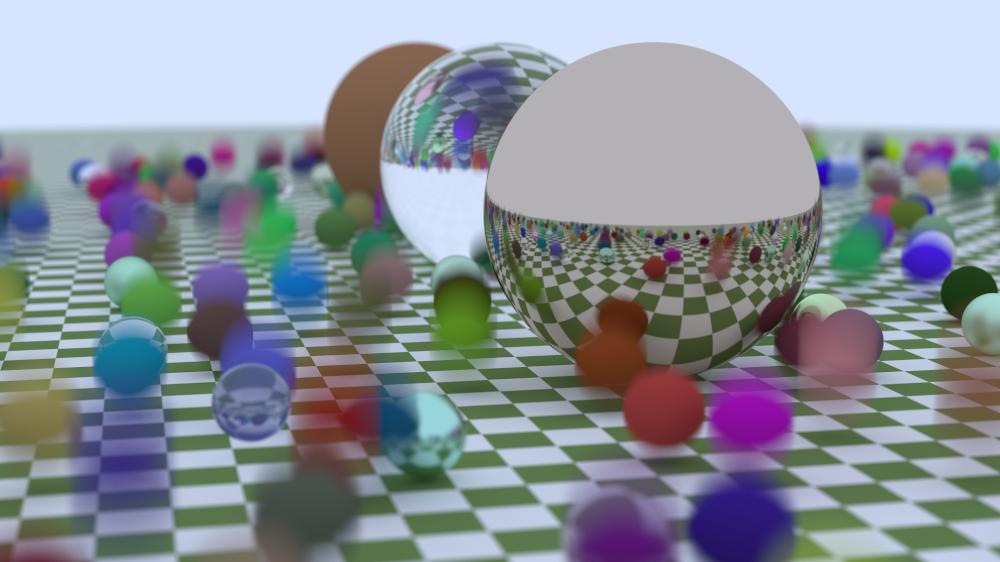
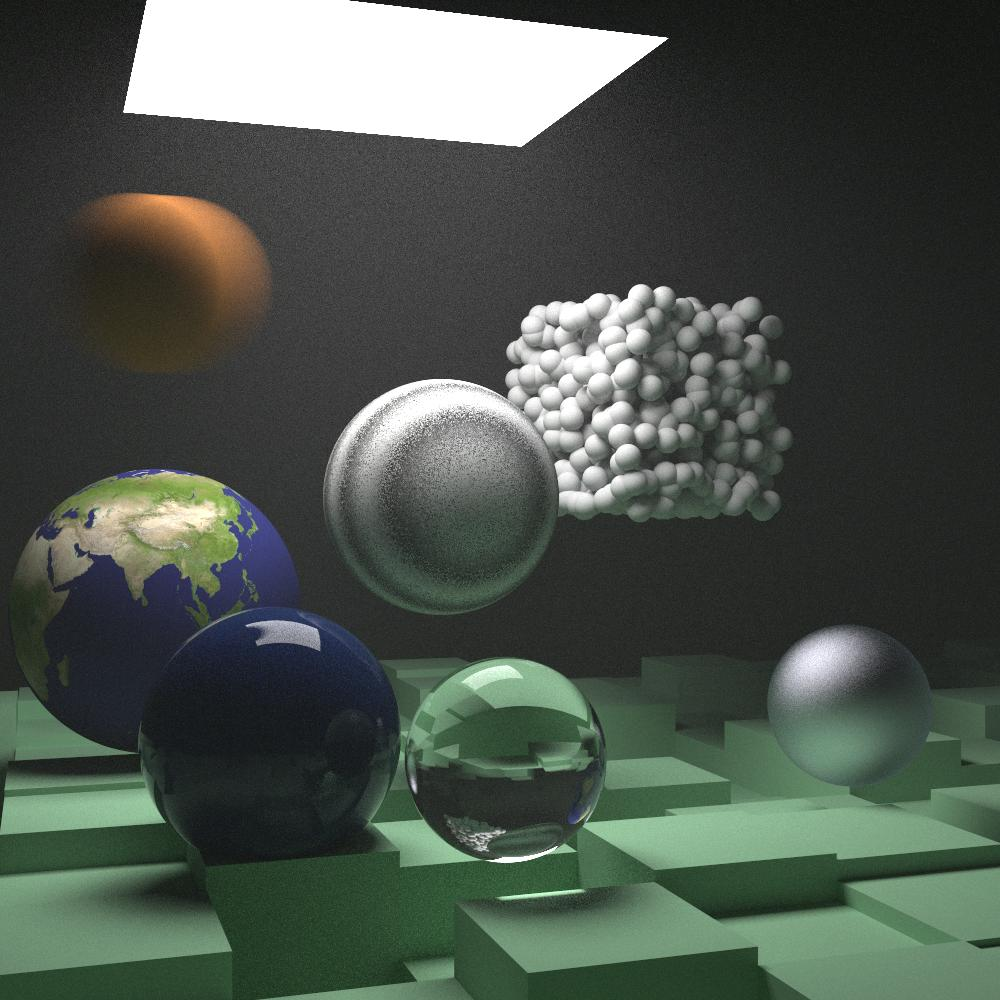
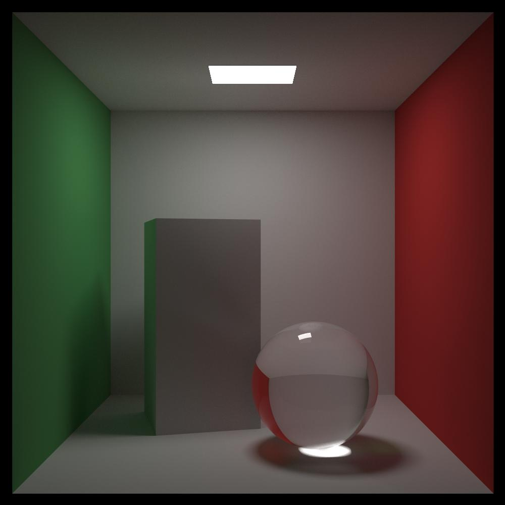

# Ray Tracing in One Weekend - Rust





## Usage

```bash
cd <repository_root>/v4/the_rest_of_your_life
cargo run --release > image.ppm
```

## References

* <https://inzkyk.xyz/ray_tracing_in_one_weekend/>
* <https://raytracing.github.io/books/RayTracingInOneWeekend.html>
