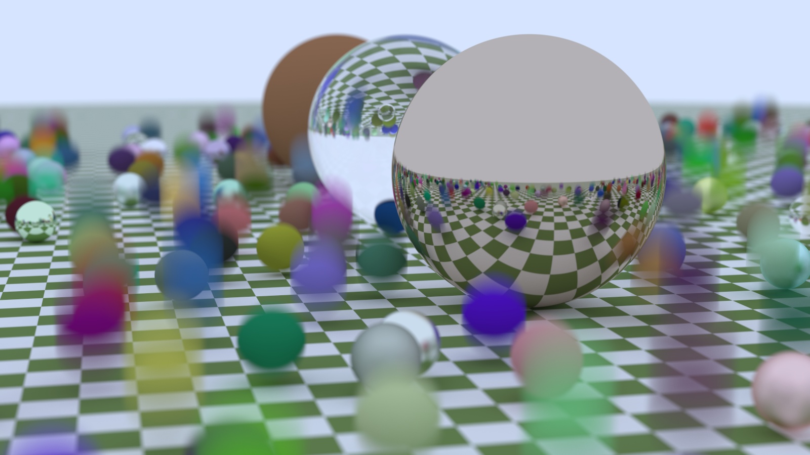
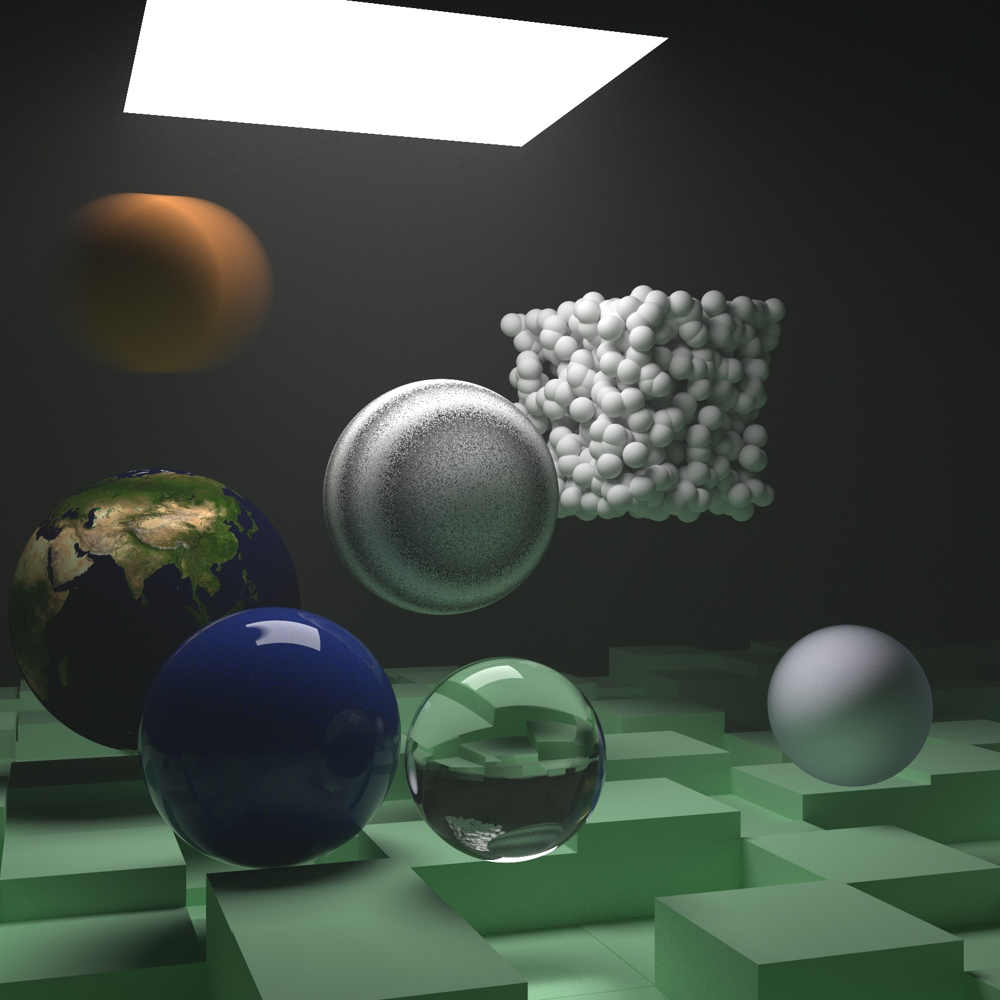
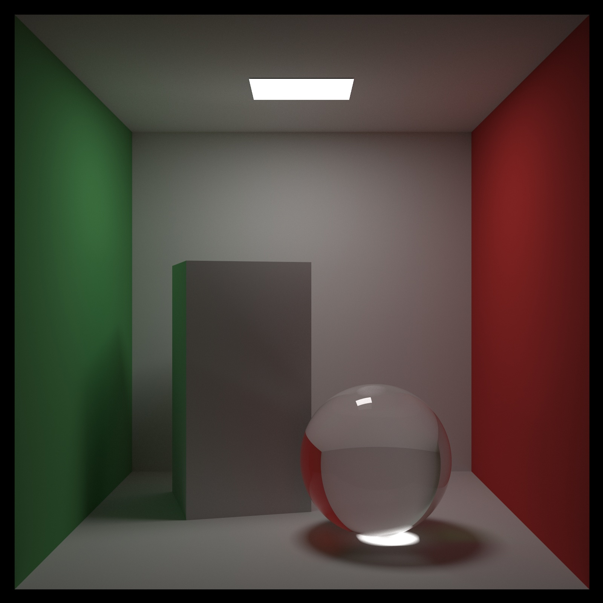

# Ray Tracing in One Weekend - Rust





## Usage

Render `cornell_box`:

```bash
cd v4/the_rest_of_your_life
cargo run --release > img.ppm
```

## Comparison

[Comparison with the Lean implementation](https://github.com/takah29/ray-tracing-in-one-weekend-lean#comparison)

## References

* [Ray Tracing in One Weekend](https://raytracing.github.io/)
